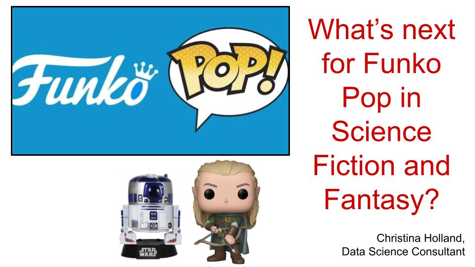

# Natural Language Processing and Funko POP figures
### Christina Holland

## StreamLit app:

https://share.streamlit.io/christinaholland/redditapp/main/reddit.py

## Thanks for visiting!

email: mailto:clh@cholland.me

LinkedIn: https://www.linkedin.com/in/christina-holland-7400a1140/

## Executive Summary

Funko POP figures have populated the homes and office spaces of pop culture and genre fans all around the world. But the world of genre fandom, Funko's market base, is an ever shifting landscape with books and shows exploding into the forefront, and others falling from favor (looking at you, Game of Thrones). How best to keep up with that, and keep a finger on the pulse of the fandom, in order to always offer the specific figures they most desire? 

__The answer is Data science.__

Through the wonder of classification models built with natural language processing, this study will analize thousands of comments on fan subreddits to determine the latest hot topics in fantasy and science fiction. By using a classification model to separate and correctly identify comments from the subreddits r/fantasy and r/scifi (each 12 years old, and over a million menbers each), we can identify trending topics: words or phrases that are specifically and quintessentially "fantasy" or "science fiction".

A wide range of classification models were run to separate r/fantasy from r/scifi: Naive Bayesian, Logisitic Regression, K Nearest Neighbors, Random Forests, and Support Vector Classification. Models were selected primarly on the basis of overall accuracy on the test data after a train test split. Accuracy was chosed over such measures as sensitivity to a particular class because there was no reason to prioritize either class over the other. Many of the models were severely overfit, and regularization to reduce this was attempted, but with limited success. Where the delta between train and test was reduced, it unfortunately also meant a falloff in the actual test accurace score. Another important factor was model interpretability -- for the problem being addressed, it is critical to be able to identify specifically which words (hopefully character names or series) can be said to be distinctly fantasy or science fiction and important to those subgenres. As it turns out, logistic regression was the clear winner in both accuracy on new data (test score) and interpretability.

As a result of this analysis, the two subreddits can be accurately predicted about 81% of the time, and the words that most influence that prediction are indicative of potential areas of investment by Funko corporation. 

In fantasy, the two words that came to the forefront were "hobbit" and "malazan". It's not surprising that the works of J.R.R. Tolkein are hugely popular among fantasy fans, and indeed the fact that "hobbit" shows up prominently is a proof of concept, since Funko already enjoys success with hobbit related figures. *Malazan Book of the Fallen* is another very popular series of books, and is character rich -- lots of room for Funko POP figures.

In scifi, "expanse" was prominent, as was "amos". Amos Burton is a main character in the extremely popular book and TV series "The Expanse". No Funko POP figures exist for the expanse, but there is clear demand, shown by the existence of fan-made custom Expanse POP figures. And as another proof of concept, "trek" also featured among the important words, and Funko has a lucrative market in Star Trek POP figures.

## Problem Statement

> "Funko history began in 1998 when Mike Becker founded the little company with a nostalgia-themed bobblehead line called Wacky Wobblers. The first item the company ever created was the Big Boy bobblehead. Over time, this once small company became a huge obsession with collectors and pop culture enthusiasts worldwide. The company’s most successful line, the Pop! Vinyl figure, officially debuted in 2010 (originally called Funko Force 2.0) and started a new addiction fans never knew they were craving." https://www.entertainmentearth.com/news/history-funko/

 

#### Funko POP figures have populated the homes and office spaces of pop culture and genre fans all around the world. I'm not even sure how many there are in my own home, but I know I am eagerly awaiting the new WandaVision figures which look amazing but aren't out until the fall. But the world of genre fandom, Funko's market base, is an ever shifting landscape with books and shows exploding into the forefront, and others falling from favor (looking at you, Game of Thrones). How best to keep up with that, and keep a finger on the pulse of the fandom, in order to always offer the specific figures they most desire? 

### The answer is Data science.

Through the wonder of classification models built with natural language processing, this study will analize thousands of comments on fan subreddits to determine the latest hot topics in fantasy and science fiction. By using a classification model to separate and correctly identify comments from the subreddits r/fantasy and r/scifi (each 12 years old, and over a million menbers each), we can identify trending topics: words or phrases that are specifically and quintessentially "fantasy" or "science fiction".

 

We do expect some challenges to this effort, as the worlds of fantasy and science fiction are quite interwoven: often bookstores will lump all their genre books into a single section titled "Fantasy & Science Fiction" or just "Speculative Fiction". There are many examples of this overlap: 

* WandaVision showcases the marriage of a powerful witch and a synthezoid. 

* My favorite books as a kid were a series by Anne McCaffrey with fire-breathing telepathic dragons and their riders in an agrarian world, but if you read the prologue (which I always skipped back then), you found out that the world was a lost Earth colony and the dragons were bioengineered. 

* Star Wars is probably close to the most famous science fiction series of all time, and yet the Jedi and Sith rely on an apparently magical "force" to fight their battles and steal the occasional blue cookie. 

It's all a bit of a muddle, but proper classification models can still pull the essential elements of the two fandoms apart.

 

A number of different types of models will be compared in this project, to see which methodology can best (most accurately) separate conversations about fantasy from those about science fiction. Ultimately the goal is to pick out the important words in each genre, though, so we will need to choose one of the more interpretable models for this analysis, but we still want to know how it stacks up against other techniques.

## Data Dictionary

After pre-processing, my data was in the following form:

| Column | Dtype | Description | Number of entries | 
| --- | --- | --- | --- |
| comment | object | text of reddit comments --> "X" | 18656 |
| date | int64 | UTC Created value - only used DURING data collection, not after | 18656 | 
| types | object | 'fantasy' (50.2%) or 'scifi' (49.8%) --> "y" | 18656 |
| char_length | int64 | number of characters in comment - used in preprocess and analysis, not in model | 18656 |
| flagged | int64 | 0 or 1 for whether it was a moderator removed comment -- all "1" rows have been removed | 18656 |

I realized literally while watching other people's presentations that I never actually changed my "y" to be numeric - I left it as 'fantasy' and 'scifi' instead of 0 and 1. I was afraid that woulld undermine my results, so this notebook is to test that effect. Fortunately it did not have an effect -- sklearn appears to have binarized my y for me. See __project3_8_checkingforeffectofbinarization.ipynb__ for details.

## Project Directory

#### assets: directory of images used in this README.md file

#### data: directory where all data is stored: 

* redditcomments.csv - data file, reddit comments pulled from pushshift.io
* scores.csv - a record of the accuracy scores of all attempted models, for train and test sets
* stopwords.csv - a set of words that were deemed too common, and excluded from the classification models
* predictions.csv - the predctions from the logistic regression model
* predicted_probabilities.csv - companion to predictions.csv, contains the probabilities of each prediction

#### Instructions.md -- the original readme file for the project

#### Notebooks and scripts:

* __0_experimenting.ipynb__

This notebook exists purely for my first attempts at pulling the data, as I was just seeing how everything worked. 

* __1_getdata.ipynb & project3_1_getdata.py__

The code for pulling my data for this project resides in 1_getdata.ipynb, which was then turned into 1_getdata.py to run on the command line.

* __2_eda_modeling.ipynb__

This is the notebook where I did my data exploration and cleaning, and ran my first two very simple models, Naive Bayesian and Logistic Regression.

* __3_ridge_lasso.ipynb__

Wherein I attempt some more to get better results out of my logistic regression model.

* __4_KNN.ipynb__

Wherein I try using K Nearest Neighbors to see if I can do better. It didn't turn out to be successful.

* __5_Tfidvectorization.ipynb__

Wherein I try different choices in preprocessing: TfidVectorizer instead of CountVectorizer, stemming, and lemmatizing.

* __6_randomforest_supportvector.ipynb__

Wherein I try a couple more models, random forest and support vectors.

* __7_Visualization.ipynb__

Visualizations to answer my problem statement.

* __8_checkingforeffectofbinarization.ipynb__

Just what it says. Checking (after the fact unfortunately) to see whether results depend on whether y is 'fantasy' and 'scifi' vs. 0 and 1.

## Data Collection

__Please see 1_getdata.ipynb or 1_getdata.py for code used__

The subreddits chosen for this project were r/fantasy, and r/scifi.

* Both subreddits were established in 2008 and have a large member base (2.3m for r/scifi and 1.3m for r/fantasy)
* For each subreddit, 100 batches of 100 comments each were requested from https://api.pushshift.io/reddit/search/comment. That's 10_000 comments per subreddit.
* I used comments, rather than posts, to capture the conversational topics.
* These reddits were chosen because they encapsulate relevant and recent conversations in the fantasy and science fiction fan communities, the market bases for Funko POP figures.
* The requests are made in a nested for loop, looping over (1) the two subreddits and (2) the 100 requests for each.
* The data is appended to the previously collected dataset after each request, and saved each time, so that if the process were interrupted we would still have data to work from and would not have to start over.
* A 5 second sleep delay is put in after each request, so as not to overwhelm the server or trip any blocking mechanisms.
* The script was developed first in the Jupyter notebook file, tested for 2 requests from each subreddit, then implemented on the command line for the full data acquisition using the python script file.

## Data Cleaning and EDA

__Please see 2_eda_modeling.ipynb for code used__

* __NULL Values:__

There was exactly one null value when I first loaded in the data, at index value 7581. Since the dataset had 20_000 comments in it, I deemed this an acceptible loss and dropped that empty comment, leaving 9_999 fantasy comments and 10_000 science fiction comments.

* __Comment length:__ 

 

Most of the comments in these subreddits are fairly short, well under 1000 characters, with the mode closer to 10-20 characters.

Looking in detail at the really short ones (under 10 characters), they are useless in terms of information - mostly containing just emojis or generic words like "lol" or "yes". I would love to be more restrictive, but I don't want to lose half my data either, so I'm just throwing out comments shorter than 10 characters.

Also there are a few really long ones that are not conversational -- they read like book reports. Not so helpful for my problem statement. So I'm throwing out any comments 1000 characters or longer.

For the problem statement to have a result, I need a dataset of comments that reflect actual conversations in the subgenres of fantasy and science fiction, and these culls get me closer to that goal.

* __Moderator actions:__

Also sometimes comments/posts on reddit get removed for various reasons. They are replaced with moderator messages, the wording of which varies depending on the specific offense that led to deletion. I did some digging to establish what moderator remove messages look like; they appear to always contain the word "removed". I may remove a few good comments this way, but I am simply dumping any comments with that word.

 

## Preprocessing

* __Stop words__

__Please see 2_eda_modeling.ipynb for code used__

The goal of this project is to separate popular topics in fantasy from popular topics in science fiction, to see what is quintessentially representative of each of the subgenres at the current moment in time, in order to market Funko POP figures that would be well recieved by each fandom.

There is a lot of overlap between these two fandoms, though, so the first step is to figure out what they have in common and eliminate that from consideration.

First, there are common words in English that are likely to show up in __any__ subreddit. Fortunately, sklearn's CountVectorizer has a built in list of common words in English, so I started with that. I also *a priori* put "fantasy", "sci", "fi", and "scifi" on the stop words list, since they are likely to appear often on their subreddits, but give us no useful information for the probalem at hand.

Then I just ran CountVectorizer, and counted the frequency of words used in each subreddit, and compared them. Any word that showed up among the top 20 words in both subreddits was added to the stop words list, and then the CountVectorizer was run again with the new list. I did this iteratively until there were no words in the "overlap" set of the top 20 fantasy words compared to the top 20 scifi words - that took just 8 iterations. I then used that new stop words list for all subsequent modeling.

* __Vectorizing__

I started with CountVectorizer (__see 2_eda_modeling.ipynb__) , and that works pretty well -- my second model, a basic logistic regression, had an accuracy of 81%. 

Later, I did try using TfidVectorizer as well (__see 5_Tfidvectorization.ipynb__), but that did not perform as well as CountVectorizer.

* __Stemming / Lemmatizing__

__Please see 5_Tfidvectorization.ipynb for code used__

Originally, I did not do either stemming or lemmatizing. I did later try to incorporate stemming using PorterStemmer from sklearn, but it did not improve model performance.

## Modeling

* __BASELINE:__

The baseline accuracy is the accuracy that would be expected with the NULL model, naively assuming that all the comments are from whichever of the two subreddits has the most comments.

After preprocessing, the dataset is 50.1983% fantasy and 49.8017% scifi, which is fortunately pretty balanced. The NULL model would have an accuracy of 0.501983. In the train test split step, though, I did use "stratify", even though the dataset is very balanced, to preserve the slight imbalance for the train and test sets. The result is a baseline score of 0.501809 for the training data and 0.501909 for the test data.

* __METRIC FOR EVALUATING MODELS:__

(1) Accuracy = (correct fantasy + correct scifi)/(all comments).

I chose accuracy because there was no reason to prioritize one group over the other. A model that does really well in identifying all of the scifi comments (sensitivity to scifi -> 1) isn't inherently better for our purposes if it also has a tendency to falsely identify fantasy comments as scifi (low specificity to scifi, or alternatively phrased, low sensitivity to fantasy). Overall accuracy preserves the equal importance of both groups.

(2) Bias vs. Variance. 

Many of the models were overfit, with an accuracy on the training data above 0.9 and an accuracy on the test data around 0.8 or below. I attempted to reduce that through regularization. However, if bringing train and test scores into line resulted in the actual test set accuracy decreasing, that was not considered to be a helpful improvement.

(3) Interpretability

Logistic regression models provide easy to understand coefficients that clearly state the importance of each feature (in this case, the words used).

Other models, such as random forests, can provide some limited information about the importance of different features (words in this case).

Still others, such as K nearest neighbors or ada boost, are more of a "black box" and do not provide interpretability, only predictions.

In this project, I ran a wide variety of models for the sake of comparison and seeing how good the predictions could get. However to answer the problem statement, a more interpretable model needs to be selected. Fortunately, that also happened to be the model with the highest accuracy score on the test data.

* __MODELS RUN:__

(1) I started with the Naive Bayesian (sklearn.naive_bayes, BernoulliNB). That gave an accuracy of 0.829448 on the train and 0.779184 on the test. It had very high sentivity to "scifi", but at the cost of reduced specifity: a tendency to mislabel fantasy as scifi.

(2) Next up was a logistic regression with the default parameters (sklearn.linear_model, LogisticRegression) - this model was overfit but still produced an 81% accuracy score.

(3) I then tried to improve the performance of the logistic regression:
* With GridSearchCV, allowing max_feature_size of 1000, 2000, 5000, and n_grams (1,1) - single words only, (1,2) - words and word pairs. Best model was max_feature_size=5000, and only single words. Reduced the overfit some, to about 0.093 vs 0.125, but the test set accuracy score was decreased.
* With Ridge Regression in LogisticRegressionCV, using alpha of 0.1, 1, and 10. This optimized the cross-validation score, but the resulting best model was actually slightly more overfit than the original (0.145 for train-test-split).
* With LASSO Regression in LogisticRegressionCV, run separately (because my computer was melting down) for alpha = 0.1 and alpha = 1. For alpha = 0.1, it was more overfit in TTS than originally. With alpha = 1, the overfitting decreased to 0.103, but the test accuracy score also decreased.

(4) I also tried k Nearest Neighbors(sklearn.neighbors, KNeighborsClassifier) to compare model accuracies. I did a manual loop instead of a gridsearch, because (a) I was concerned these models might take a long time to run, and (b) to be able to pull more information from each one if it panned out. I searched over k (number of neighbors) = 1, 3, 5, 25, and 501 (all odd to avoid ties), and weighting of uniform vs. distance (but staying with the Euclidean definition of distance, not Manhattan or anything else). 
* With uniform weighting, the model is extremely overfit for small k and approaches the baseline accuracy for large k.
* With distance weighting, it's overfit for all tested values of k.
* There doesn't seem to be any evidence of a "sweet spot" that would reduce bias and variance and beat my simple logistic regression model with the test score.

(5) Going back to the logistic Regression model, I tried varying the pre-processing by using frequency vectorization (TfidVectorizer) instead of CountVectorizer, and with stemming vie PorterStemmer. Neither was able to improve my accuracy.

(6) I also tried a random forest model, with gridsearch over max_depth= 10, 100, 1000 and min_samples_split= 10, 100, 1000. It returned a best score of 0.776086093241204 in GridSearchCV for max_depth= 1000 and min_samples_split= 10, but the test train split showed it to be massively overfit, with a difference of 0.208 between train and test accuracy (and lower test accuracy than the original logistic regression).

(7) Finally, I attempted a support vector model. With a trainscore of 0.9933533447684391 and a test score of 0.8096054888507719, this was
almost as good as the logistic regression (in accuracy), but another massively overfit model.

* __MODEL SELECTION:__

The scores list is below (note that the random forest support vector models were ommitted from this table), ordered with maximum test set accuracy at the top of the list. The number in the leftmost column indicates the order in which the model was run.

Of course, accuracy is only part of the model selection process. In order to address the problem statement (using top topics of conversation that are unique to each subreddit), an *__interpretable__* model is required. The most straightforwardly interpretable model of those represented here is the logistic regression. The fact that it also has the highest accuracy on our test samples is a happy coincidence.

 

__PROBLEMS WITH THE MODEL (AREAS FOR FURTHER WORK):__

* __COMMENT LENGTH:__

Most of the comments are short. In pre-processing I eliminated all comments that were shorter than 10 characters (and the few 1000+ character comments). By adjusting the lower bound requirement of comment length to be stricter, I can get higher model scores. But in the process I am losing substantial amounts of data:

| Minimum Comment Length | Number of comments after pre-processing |
| --- | --- |
| 10 | 18656 |
| 50 | 14891 |
| 100 | 10937 |
| 200 | 6064 |

With the cutoff at 200 characters, I can get the logistic regression accuracy to 0.99978 for the train set, and 0.85686 for the test set. But I worry that the model is weakened in terms of actual application in the real world by the smaller dataset. Also it is more unbalanced, with the NULL model of assuming all comments are "fantasy" accurate 0.586 of the time (vs. 0.502).

This may well be the correct way to refine this model. However I would also want to have a larger initial dataset, so that the "pruned" data was still large.

 

* __SUBREDDIT TENDENCIES, to "reading" vs. "viewing"__

This part surprised me. There are plenty of examples of both science fiction and fantasy in the world of books and printed media, and also plenty of both in the world of TV and movies. So I expected that running a classification model to separate comments made in r/scifi and r/fantasy would bring to light subgenre specific words related to names of popular series and characters, as well as words related to science/technology in r/scifi and related to lore/magic in r/fantasy. In fact, I immediately saw another difference:

Words related to reading, books, etc. tended to pop out for r/fantasy and words relatedto viewing or watching shows tended to pop out for r/scifi. To test this, I went back to the original (unvectorized) comments in the test set. I made a list of 10 words related to reading and another list of 10 related to viewing -- these were purely just words I came up with, separate from the model, and I intentionally kept the lists uniform length and short. Then I just looked to see how frequently my words popped up in the comments:

 

|  | comments containing 1+ "reading" word | comments containing 1+ "watching" word | comments with both |
| --- | --- | --- | --- |
| correctly identified "fantasy" | 39.1% | 1.4% | 2.9% |
| incorrect identifications | 19.6% | 5.8% | 3.3% |
| correctly identified "scifi" | 8.4% | 22.7% | 3.2% |

Reading related words were clearly more common in r/fantasy, and viewing words in r/scifi. The fact that the incorrectly labeled comments had counts between the two correct groups indicates to me that these themes are a part of how the model is classifying the reddit comments.

Looking over some typical comments on r/fantasy and r/scifi bears this out, but words like "chapter" or "movie" are not going to be helpful to Funko POP.

 

To mitigate this, there are a couple of possible strategies:

(1) Add any media specific words like this to the stop words. However this is likely to drive down the model accuracy, since the model is clearly using these types of words, in part, to make its predictions (The #2 and #4 strongest negative coefficients, indicating "fantasy", are for "maps" at -2.160810 and "covers" at -2.040552. On the other end, "film" comes in at #4 most positive at 1.999415, indicating "scifi".) So if this was done, we would probably need a lot more data to get a good model.

(2) Add in more data to balance this effect. Upon investigation, it turns out that there is another subreddit, r/printSF. I didn't choose it for my analysis because it is smaller. But a future iteration of this effort could take it in as a third data source, and label both r/scifi and r/printSF as "scifi".

__MODEL INTERPRETATION:__

* The logistic regression model provides coefficients for each model feature (in this case, words from the comments) that show how strongly they would tend to push a datapoint into one group or the other.

* Given a logistic model coefficient "c", you can compute the associated "odds" ratio: odds = ec.

So in the context of this model, where each feature is the count vectorization of the text (the number of times each word shows up in the text), if a given word has a coefficient "c", its presence in a comment makes the ratio of odds of being sorted into type "1" (in this case, that is "scifi") to the odds of sorting into "0" ("fantasy") : ec.

https://stats.idre.ucla.edu/other/mult-pkg/faq/general/faq-how-do-i-interpret-odds-ratios-in-logistic-regression/

If the coefficient is negative (c<0), then the the odds ratio of "scifi" over "fantasy" is a fraction because ec < 1. But the laws of exponents state that a-n = 1 / an, so the ratio of the odds of "fantasy" over the odds of "scifi", the inverse of the original odds ratio, is just 1 / ec, and will be greater than 1.

## Conclusions and Recommendations:

### Original Problem Statement: What’s next for Funko Pop in Science Fiction and Fantasy?

### Reframed in a __*quantifiable*__ form: What are people talking about in Science Fiction and Fantasy?

#### So what have we learned?

__*Top 5 "fantasy" words:*__

| word | coefficient | 	odds(fantasy)/odds(scifi) | number of scifi comments | number of fantasy comments |
| --- | --- | --- | --- | --- |
| malazan | -2.473070 | 11.858802 | 0 | 37 |
| maps | -2.160810 | 8.678164 | 1 | 25 |
| hobbit | -2.121941 | 8.347323 | 0 | 37 |
| covers | -2.040552 | 7.694859 | 0 | 18 |
| redwall | -2.006636 | 7.438252 | 0 | 15 |

[Note: The number of scifi comments and number of fantasy comments containing each word was calculated on the TEST data]

__*Fantasy candidates:*__

(1) "malazan" 

I had never heard of it, but Malazan Book of the Fallen is apparently a very popular series of books. No Funko POP figures appear to exist. This would be a strong candidate to explore for a new Funko POP series of figures.

 

[And note to self - should I get these books?]

(2) "hobbit" 

Well, yes, this makes sense, given the long-standing popularity of J.R.R. Tolkein's Hobbit and Lord of the Rings books. Funko POP already makes a ton of hobbit figures, according to amazon.com. This is a good proof of concept for this modeling approach, actually.

 

__*Top "scifi" words:*__

| word | coefficient | 	odds(scifi)/odds(fantasy) | number of scifi comments | number of fantasy comments |
| --- | --- | --- | --- | --- |
| foundation | 2.321143 | 10.187317 | 16| 3 |
| expanse | 2.220535 | 9.212258 | 43 | 8 |
| alien | 2.117538 | 8.310650 | 40 | 3 |
| film | 1.999415 | 7.384735 | 53 | 6 |
| trek | 1.989379 | 7.310991 | 40 | 1 |

__*SciFi candidates:*__ 

(1) "foundation"

Isaac Asimov's foundation series scores high, even though the word "foundation" is kind of basic and also shows up in r/fantasy. But that series is SO DENSE and has SO MANY characters, I don't know that I could recommend POP figures for them.

(2) "expanse"

Seriously, how have they not already done figures for The Expanse? I see Amos would be a particularly good choice, since "Amos" also shows up with a coefficient of 1.842457, the 6th highest in the model.

 

No POP figures, but there are figures from another company, Kidrobot (exclusive deal maybe?)

Also LOTS of fan-made custom figures for the crew of the Roci, which just further illustrates the presence of demand.

(3) "trek"

It's not surprising that Star Trek would make the list, but there are already plenty of Funko POP figures on the market for Trek characters. Another proof of concept.

__*Avenues of Future Work:*__

* Amass a larger dataset
* Include other genre related subreddits (such as r/printSF)
* Experiment further with the impact of comment length
* Further tune the model to reduce the overfit, while retaining high accuracy for new data
* Conduct market research via focus groups and begin design on some of the recommendations highlighed by the model: Specifically, Malazan Book of the Fallen for fantasy fans and The Expanse for science fiction fans are likely to be successful directions for Funko POP figure development.
